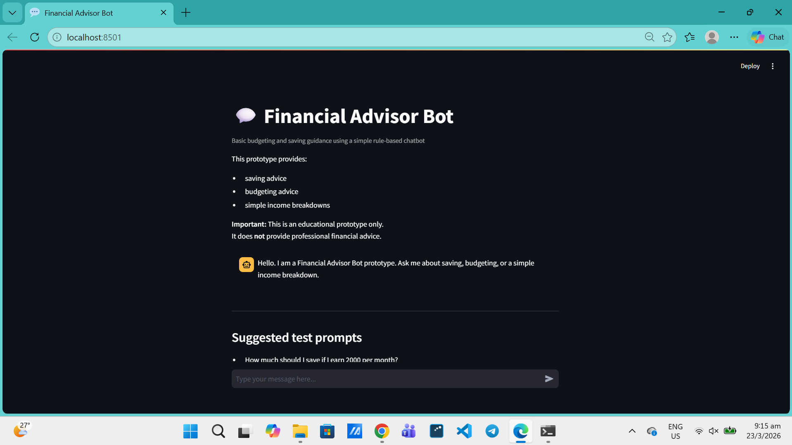
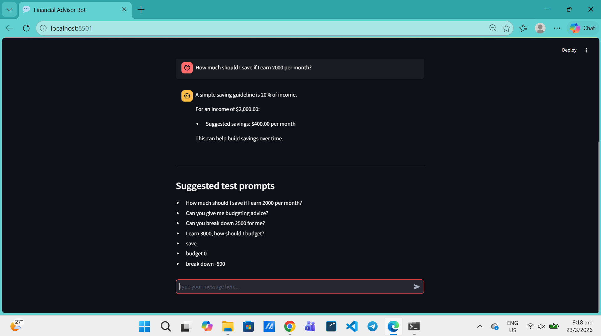
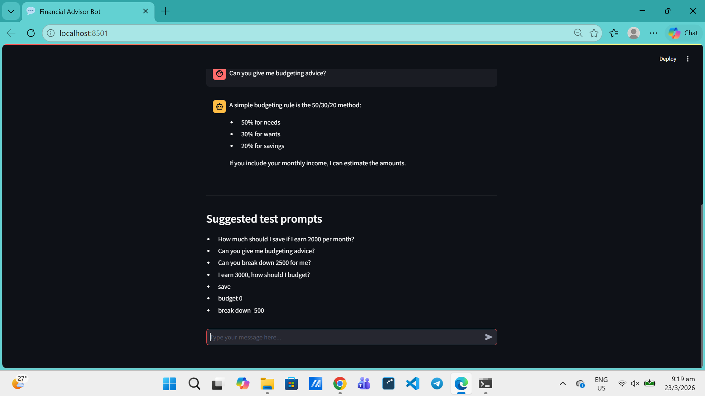
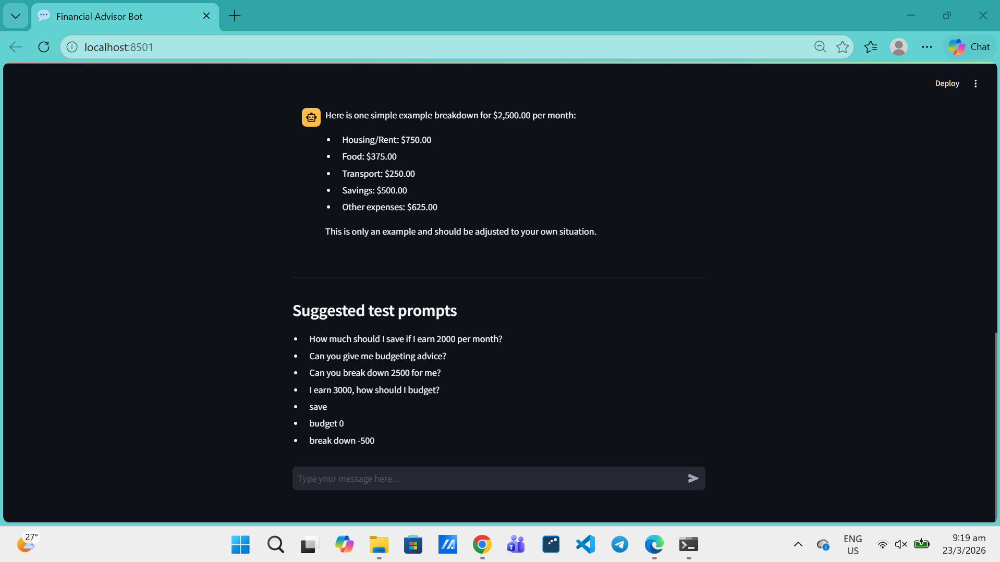
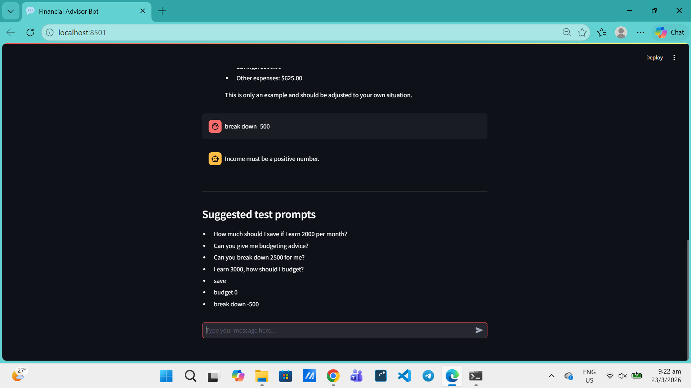

# Financial Advisor Bot

## Project Overview
This project is a simple chatbot that gives basic financial advice. It focuses on saving, budgeting, and splitting income into categories. The main goal is to show how simple financial rules can be applied using a program.

The chatbot is built using Python and Streamlit. It does not use AI. Instead, it works by checking keywords in what the user types and then giving a response based on fixed rules.

---

## Features
- Calculates savings using a basic 20% rule  
- Shows budgeting using the 50/30/20 method  
- Breaks down income into common expense categories  
- Handles invalid inputs like 0 or negative values  
- Runs as an interactive web app  

---

## How It Works
The chatbot is rule-based and uses simple keyword detection.

- If the input includes "save", it calculates 20% of the income  
- If it includes "budget", it applies the 50/30/20 rule  
- If it includes "breakdown", it splits the income into categories  

It extracts numbers from the sentence and uses them directly. If no valid number is found, it returns a default response.

---

## Technologies Used
- Python  
- Streamlit  

---

## How to Run

1. Install the required libraries  
pip install -r requirements.txt  

2. Run the program  
streamlit run app.py  

3. Open the browser  
http://localhost:8501  

---

## Example Inputs
- How much should I save if I earn 2000 per month?  
- Can you give me budgeting advice?  
- Can you break down 2500 for me?  
- I earn 3000, how should I budget?  
- budget 0  
- break down -500  

---

## Screenshots

### Home Screen

### Saving Example

### Budget Example

### Breakdown Example

### Invalid Input Example

---

## Limitations
- Only uses simple rules, no AI or learning  
- Cannot handle complicated questions  
- Advice is general and not personalised  
- Does not save user data  

---

## Future Improvements
- Add better language understanding (NLP)  
- Improve responses to be more flexible  
- Add charts for better visualisation  
- Store user data for tracking  

---

## Disclaimer
This project is for learning purposes only. It should not be used as real financial advice.